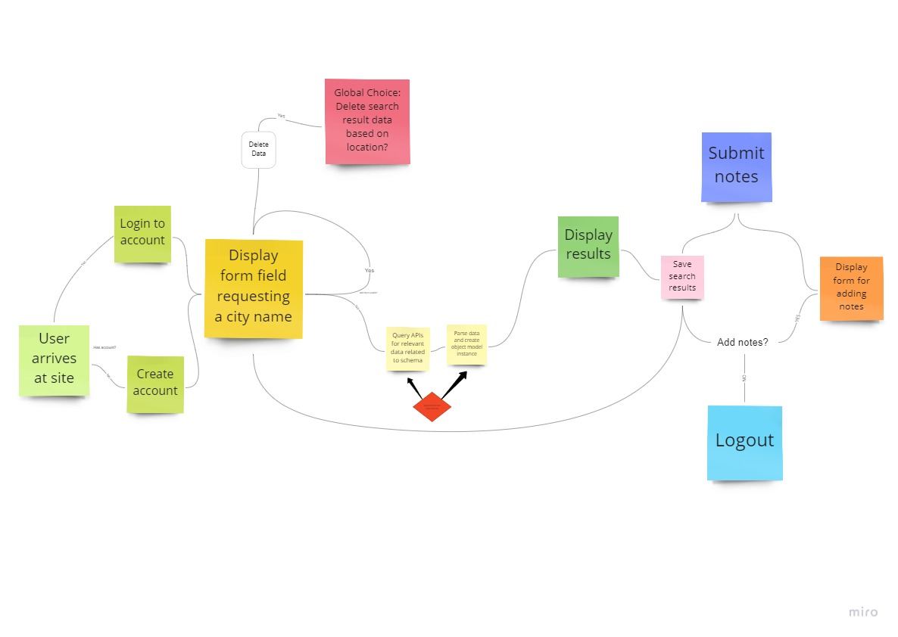
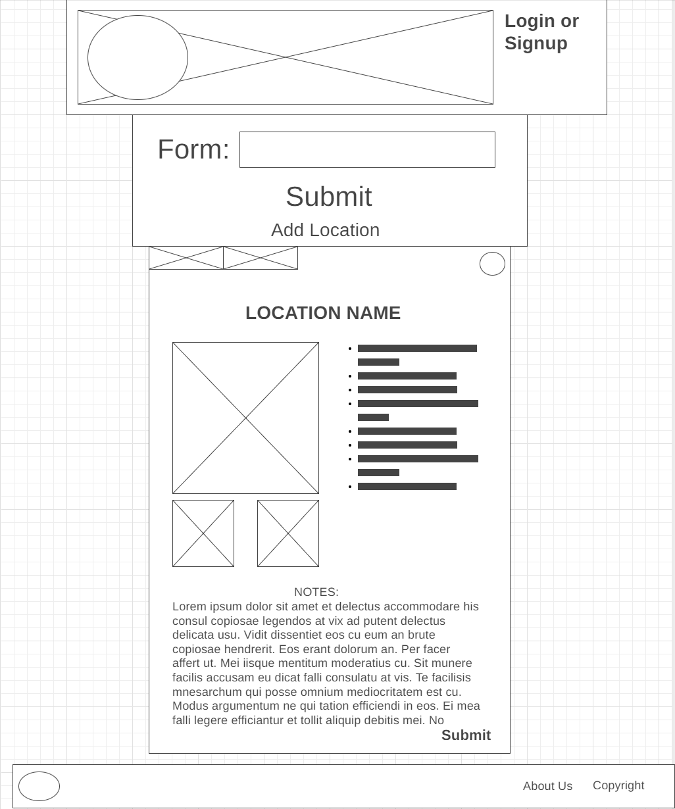
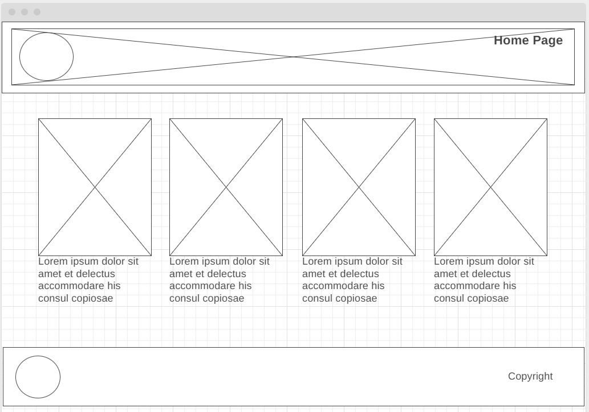

# TravelBytes

## Project Description

A group project to create a travel information website which can supply the user with a variety of data provided from a selection of APIs across the internet to aid travelers when they go abroad.

## Group Members

- Dan Awesome
- Stephen Clemmer
- Timothee Odushina
- Brian Sward

## Data Flow

## Wireframes

[Home Page](https://wireframe.cc/gGveoX)

[About Us](https://wireframe.cc/GbVnTK)

## Travel Bytes

Connecting people with places before they go so they don't arrive unprepared.

## Developers

Tribe Delta  
Sept. 09/05/2022

- Dan Awesome
- Stephen Clemmer
- Timothee Odushina
- Brian Sward

## Tools, Library's and Framework

React.js  
React-Bootstrap
Regex
Auth0
Axios
Heroku
Netlify - travelbytes.netlify.app
MongoDB
Mongoose
Mapbox API
RestCountries API
LocationIQ API

## Stretch Goals

### Plug Data Resources

Type of plug in each country:

- [chart info obtained here](https://www.skyscanner.net/news/international-travel-plug-adapter-guide)

- plugs.png is borrowed from their site used as well

### The exchange rate for each country

ExchangeRate-API
